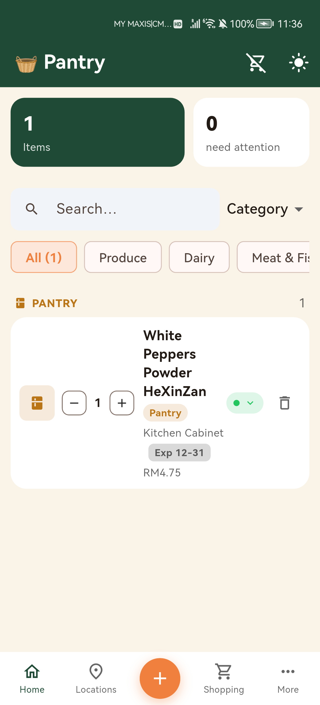
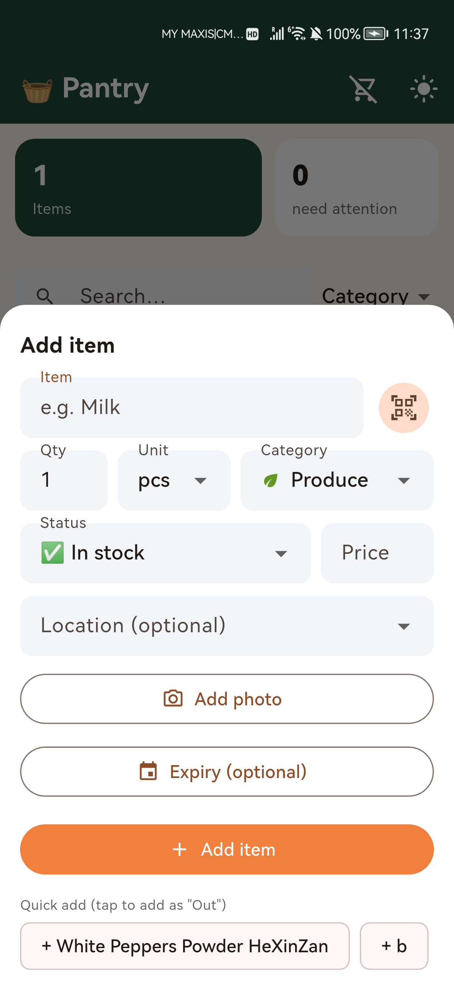
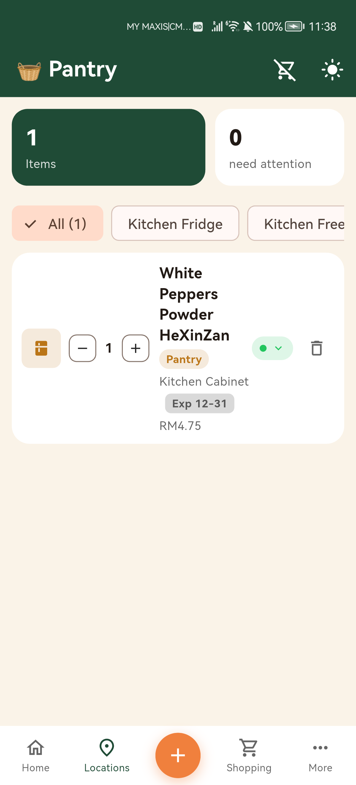
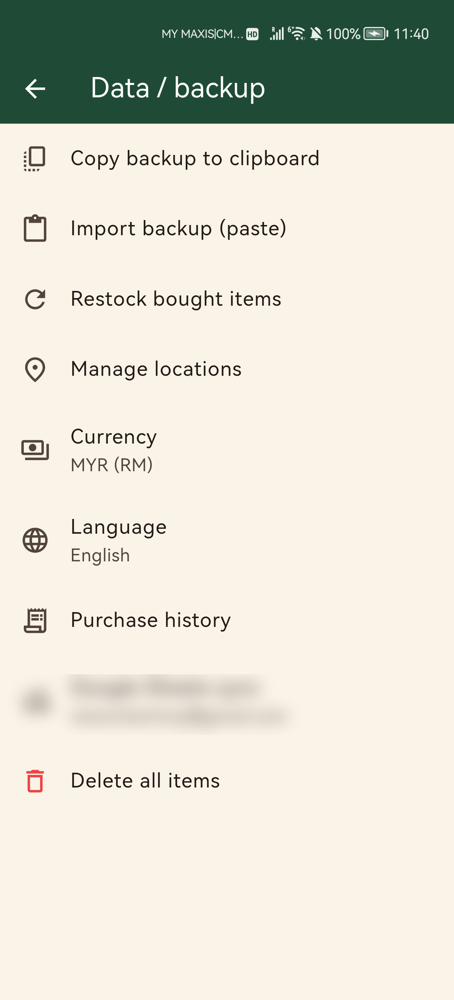

# Pantry

A household groceries and inventory tracker for Android, built with Flutter. Scan barcodes to add items, track expiry dates and storage locations, deduct stock as you use things up, and keep the whole household in sync through a shared Google Sheet.

## Screenshots

| Home | Add item | Locations | Settings |
|---|---|---|---|
|  |  |  |  |

## Features

- **Custom branded UI** — bottom navigation (Home / Locations / Shopping) with a floating add button, hero stat cards, and a color-coded category system, themed around the app's own logo
- **Barcode scanning** — scan to add items, with automatic name lookup (Open Food Facts) and a local barcode→name memory that works offline and covers products the online database doesn't have
- **Categories** — Produce, Dairy, Meat & Fish, Pantry, Frozen, Bakery, Drinks, Snacks, Toiletries, Cleaning Supplies, Personal Care, Household, Other — each with its own color and icon
- **Units** — track quantity in pcs, g, kg, ml, L, pack, box, bottle, or can
- **Expiry tracking** — see what's expiring soon at a glance, with a dedicated shopping list for anything running low, out, or about to expire
- **Storage locations** — tag items with freeform locations (e.g. "Kitchen Fridge", "Garage Freezer") and browse inventory by location
- **Photos** — attach a photo to any item (stored locally on-device)
- **Consume / deduct flow** — scan or tap an item to mark it used, without digging through a form
- **Purchase history** — every addition is logged, and past entries can be edited or deleted if something was recorded wrong
- **Multi-currency** — MYR by default, switchable to USD, SGD, EUR, GBP, JPY, CNY, IDR, THB, AUD
- **Multi-language UI** — English, Chinese (中文), and Malay (Bahasa Melayu)
- **Google Sheets sync** — connect a Google account and link a spreadsheet to back up and share your inventory across devices. Sync merges changes per item (newest edit wins, nothing is silently overwritten) so multiple household members can use the app against the same spreadsheet without clobbering each other's edits
- **Works without Google Play Services** — sign-in uses a device-code OAuth flow (open a link, type a code) rather than the native Google Sign-In SDK, so it works on Huawei/HarmonyOS phones and other devices without GMS

## Tech stack

- [Flutter](https://flutter.dev) (single-file app, `lib/main.dart`) targeting Android
- [`mobile_scanner`](https://pub.dev/packages/mobile_scanner) for barcode scanning
- [`shared_preferences`](https://pub.dev/packages/shared_preferences) for local storage
- Plain REST calls to the [Google Sheets API v4](https://developers.google.com/sheets/api) and Google's [OAuth 2.0 device authorization](https://developers.google.com/identity/protocols/oauth2/limited-input-device) endpoint — no Google Play Services dependency

## Building

```bash
flutter pub get
flutter build apk --release
```

The output APK is at `build/app/outputs/flutter-apk/app-release.apk`. Sideload it with:

```bash
adb install -r build/app/outputs/flutter-apk/app-release.apk
```

## Setting up Google Sheets sync

Sync is optional — the app works fully offline without it. To enable it for your own build:

1. Create a project in [Google Cloud Console](https://console.cloud.google.com)
2. Enable the **Google Sheets API** and **Google Drive API**
3. Configure the OAuth consent screen (External, Testing mode is fine) and add your Google account as a test user
4. Create an OAuth client of type **"TVs and Limited Input devices"** — this returns a Client ID and Client Secret
5. Set `DeviceFlowAuth.clientId` and `DeviceFlowAuth.clientSecret` in `lib/main.dart` to your own values

(These credentials aren't confidential for this client type — see [Google's docs](https://developers.google.com/identity/protocols/oauth2/limited-input-device) — but if you'd rather keep your own out of a public fork, move them into a separate gitignored file instead.)

## License

Personal project, no license specified.
